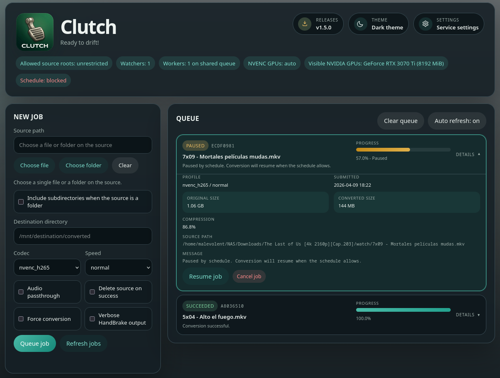

<p align="center">


Clutch manages video transcodes through HandBrakeCLI from the command line or from a browser dashboard. `clutch` handles single files, recursive libraries, watched folders, and a shared LAN service with a persistent queue.



## Features at a glance

- Convert single files, whole folders, recursive trees, file globs, and ISO images.
- Encode with `nvenc_h265`, `nvenc_h264`, `x265`, or `av1`.
- Preserve audio and subtitle tracks, with optional audio passthrough.
- Run several local workers in parallel for faster batch processing.
- Rotate NVENC jobs across selected NVIDIA GPUs with `--gpus 0,1`.
- Skip wasteful re-encodes using codec-aware and muxer-aware detection.
- Check for updates and upgrade in place with the built-in `--update` and `--upgrade` commands, plus daily release reminders in the CLI.
- Expose an HTTP service with a built-in dashboard to inspect the queue and submit jobs remotely.
- Show a dashboard release icon with a badge when the service detects a newer version, including one-click upgrade and restart.
- Persist service configuration, worker count, GPU list, and watched folders in SQLite.
- Watch folders and auto-enqueue new videos once they stop changing on disk.
- Include a `change-title` helper to sync MKV title metadata with the file name.

## Requirements

You only need [HandBrakeCLI](https://handbrake.fr/downloads2.php) to run the main converter.

For the full feature set, install these tools as well:

- `mediainfo`
- `mkvpropedit`
- `pv` (optional, used by the shell helpers)

## Installation

### One-liner install (no manual clone needed)

The GitHub repository now lives at `adocampo/clutch`, and the installer and self-update commands below use the renamed repo.

```bash
curl -fsSL https://raw.githubusercontent.com/adocampo/clutch/master/install.sh | bash
```

The installer detects your OS and package manager, ensures Python 3.9+, venv, and pipx are available, clones the repo to a temporary directory when needed, installs `clutch` via pipx, checks runtime dependencies, and places the systemd user unit on Linux.

### Install from a local clone

```bash
git clone https://github.com/adocampo/clutch.git clutch
cd clutch
bash install.sh
```

### Direct install with pipx from GitHub

```bash
pipx install git+https://github.com/adocampo/clutch.git
```

### Verify installation

```bash
clutch --version
```

## Why this exists

Usually, when you download movies and TV shows, you end up with plenty of formats and codecs. Older codecs such as AVC waste a lot of disk space compared to newer ones such as AV1, but not every player can handle AV1 smoothly yet.

I have plenty of space in my home server, but I realized I could save a huge part of it just by re-encoding my video library.

At first, I used ffmpeg. Converting AVC (H.264) to HEVC (H.265) saved a lot of space, but I wanted better results.

Then I tried AV1. Compression was excellent, but with an NVIDIA RTX 3070 I still had to encode AV1 on the CPU instead of the GPU, which is far too slow when you have hundreds of videos.

So I started automating the workflow. After comparing outputs, HandBrake consistently produced much better compression for my media than the presets I had tuned manually in ffmpeg.

### The good

With the right HandBrake presets, I was able to shrink some 60 GB H.264 BDRips to around 2 GB in AV1 while keeping very good quality.

### The bad

If you do not have NVIDIA 40-series hardware, AV1 encoding on the GPU is not available, so large AV1 jobs can still take a long time.

### The ugly

HandBrake H.265 was good enough that it often got close to AV1 compression while still letting me use NVENC, which means a one-hour video can finish in just a few minutes on the GPU. That is the workflow this project is built around.

## Development setup

If you want to contribute or test the latest development version:

```bash
git clone https://github.com/adocampo/clutch.git clutch
cd clutch
python3 -m venv .venv
source .venv/bin/activate
pip install -e .
```

Inside the virtual environment, use the regular `clutch` command:

```bash
clutch --version
clutch -r ~/Videos/
```

If your system also has `clutch` installed through `pipx`, activate `.venv` before running it so the virtual environment version takes priority in `PATH`.

## Updating

### Self-update from the tool itself

On the first normal CLI run of each day, `clutch` also performs a lightweight cached release check and prints a reminder when a newer version is available.

```bash
# Check if a new version is available
clutch --update

# Upgrade to the latest version
clutch --upgrade
```

### Manual update with pipx

```bash
pipx install git+https://github.com/adocampo/clutch.git --force
```

## Uninstalling

```bash
pipx uninstall clutch
```

## Smart codec detection

`clutch` automatically detects the current video codec and muxer before converting, avoiding unnecessary re-encodes:

### Codec quality hierarchy

The script understands that some codecs produce better compression than others:

```text
AVC (H.264) < HEVC (H.265) < AV1
```

- If the source is in a **worse** codec than the target (e.g. AVC → HEVC), it **converts** normally.
- If the source is already in a **better** codec than the target (e.g. AV1 → HEVC), it **skips** the file and warns you.
- If the source is in the **same** codec as the target, it checks the muxer (see below).

### Why HandBrake gets special treatment

I have experimented extensively with ffmpeg, mkvmerge, and HandBrake for video encoding. While all three can produce valid H.265/AV1 output, I have consistently achieved significantly better compression results using HandBrake's built-in presets compared to anything I could configure with ffmpeg or mkvmerge. The HandBrake team clearly knows a lot about encoding tuning and their presets are incredibly well optimized.

Because of this, the script treats the muxer as a quality signal:

- **Same codec + muxed by HandBrake** → The file is already optimally compressed. The script **skips** it with a message: `[SKIP] 'file.mkv' is already HEVC encoded by HandBrake. Use --force to override.`
- **Same codec + muxed by ffmpeg/mkvmerge/other** → The compression is likely suboptimal. The script shows a **warning** but **converts it anyway**: `[WARN] 'file.mkv' is already HEVC but was muxed by 'mkvmerge v88.0'. Converting anyway.`

Use `--force` to override this behavior and convert everything regardless.

## change-title

`change-title` is a quick script to change metadata title and make it match with its filename, so, intead of see something like

you will see this


`change-title` can be used standalone as

```bash
change-title <video_name>
```

or recursively for all Matroska files like this

```bash
find . -type f -name "*.mkv" -print0 | xargs -0 -I {} change-title "{}"
```

## Usage

### Basic usage

Convert a single file:

```bash
clutch movie.mp4
```

Convert and place output in a directory:

```bash
clutch -o ~/converted/ movie.mp4
```

### Batch conversion

Convert all videos in a directory recursively:

```bash
clutch -r ~/Videos/
```

Convert all `.mp4` files in a pattern (without subdirectories):

```bash
clutch ~/Videos/*.mp4
```

Convert all videos and auto-find them:

```bash
clutch --find  # Searches current directory
clutch --find ~/Videos  # Searches ~/Videos directory pattern
```

Convert several files in parallel with local CLI workers:

```bash
clutch --workers 3 -r ~/Videos/
```

Distribute NVENC jobs across two GPUs:

```bash
clutch --workers 2 --gpus 0,1 -r ~/Videos/
```

With more than one local worker, the CLI switches to a combined progress display that keeps all active conversions in one coordinated terminal view. Raw verbose HandBrake output is disabled in that mode so the progress view stays readable.

When you pass `--gpus`, `clutch` routes NVENC jobs through those GPU indices in round-robin order by passing `gpu=<index>` to HandBrake's NVENC encoder options. Leave it empty to let HandBrake choose the GPU automatically.

> **Note:** Multi-GPU support is implemented and ready to use, but has not been tested with actual multi-GPU hardware. If you have more than one NVENC-capable GPU, please report any issues you find.

### Service mode over the LAN

You can now run `clutch` as a service on machine A and submit jobs from another machine in the LAN.

Important: in the first implementation, machine A must already be able to access the source and destination paths as normal filesystem paths. This works well with pre-mounted SMB or NFS shares. The service does not upload files from B to A and does not mount remote shares by itself.

#### Running as a systemd service (Linux)

The installer automatically places a systemd user unit file. To enable and start the service:

```bash
systemctl --user enable --now clutch.service
systemctl --user status clutch.service
```

By default the unit runs `clutch --serve` on `127.0.0.1:8765`. To customize options (bind address, allowed roots, watchers, GPUs, etc.), edit `~/.config/systemd/user/clutch.service` and reload:

```bash
systemctl --user daemon-reload
systemctl --user restart clutch.service
```

To keep the service running after you log out:

```bash
loginctl enable-linger $USER
```

#### Manual service launch

Start the service on machine A:

```bash
clutch --serve \
  --workers 2 \
  --gpus 0,1 \
  --listen-host 0.0.0.0 \
  --listen-port 8765 \
  --allow-root /mnt/media-b \
  --allow-root /srv/convert-output
```

Then open the browser from machine B and use the built-in dashboard:

```text
http://machine-a:8765/
```

The dashboard lets you:

- submit conversion jobs without using the CLI
- inspect queued, running, completed, skipped, and failed jobs
- cancel queued jobs
- check for new releases from the dashboard and install them with confirmation when an update is available
- review the service roots and watched directories exposed by machine A
- change how many workers run in parallel on the shared queue
- change which NVENC GPU indices the service rotates across
- change the default conversion settings used by the service and future watched files
- add and remove watched directories without restarting the service

The service also performs its own cached GitHub release check once per day. When a newer version is available, the dashboard release icon shows a badge and its tooltip changes to the changelog delta between the installed version and the latest release.

Submit a job from machine B to be executed by machine A:

```bash
clutch \
  --server-url http://machine-a:8765 \
  -o /mnt/media-b/converted \
  /mnt/media-b/incoming/movie.mkv
```

If you omit `-o`, the service keeps the current behavior and writes the converted output next to the source file.

Runtime service configuration is persisted in the service database (`--service-db`). This includes allowed roots, worker count, configured NVENC GPU indices, default job settings, and watched directories configured through the dashboard, so they survive service restarts. On first start, CLI service options seed that state; after that, the persisted state is restored from the database.

Service HTTP endpoints:

```text
GET    /
GET    /health
GET    /config
GET    /watchers
GET    /jobs
GET    /jobs/<job_id>
POST   /config
POST   /watchers
POST   /jobs
DELETE /watchers/<watcher_id>
DELETE /jobs/<job_id>
```

The service starts with 1 worker by default. You can raise the worker count from the dashboard to process several jobs in parallel; all workers share the same queue. If you configure NVENC GPU indices, the service assigns NVENC jobs to those GPUs in round-robin order.

### Automatic watched-directory mode

Machine A can also watch one or more directories and automatically enqueue any new video file that becomes stable on disk.

Watch a directory and convert everything that appears there:

```bash
clutch --serve \
  --listen-host 0.0.0.0 \
  --watch-dir /mnt/media-b/watch \
  --watch-recursive \
  --watch-settle-time 60 \
  --allow-root /mnt/media-b
```

The watcher uses a polling strategy and waits until the file stops changing before queueing it, which helps avoid starting a conversion while a large file is still being copied.

When you use `--workers` in normal CLI mode, `clutch` runs that many local conversions in parallel. In `--serve` mode, the same option seeds the service worker pool on first start for that service database; after that, the persisted worker count from the database takes precedence. When you use `--gpus`, local NVENC jobs rotate across those GPU indices, and `--serve --gpus ...` seeds the service's persisted NVENC GPU list on first start for that service database.

The configured GPU indices must be visible to the process running `clutch`. If the service only sees GPU `0`, configuring `0,1` will not make GPU `1` usable until that second GPU is also exposed to HandBrake and NVENC on that machine.

### Advanced options

Convert with audio passthrough (no re-encoding audio):

```bash
clutch -ap movie.mp4
```

Convert using AV1 codec with maximum compression (slow):

```bash
clutch -c av1 -s movie.mp4
```

Auto-accept without prompts and delete source on success:

```bash
clutch -y -ds movie.mkv
```

Power off after conversion completes:

```bash
clutch -po movie.mp4
```

Force re-conversion even if file is already in target codec:

```bash
clutch --force movie.mkv
```

Show source file information (codec, resolution, audio tracks, etc.):

```bash
clutch -si movie.mkv
```

### ISO disc images

Convert a DVD/Blu-ray ISO image (automatically selects the main feature):

```bash
clutch movie.iso
```

### Help

```bash
clutch --help
```

Full help output:

```text
usage: clutch [-h] [-o OUTPUT] [--find [PATTERN]] [-r] [-ds] [-c CODEC]
                     [-s] [-f] [-n] [-ap] [--force] [--gpus GPUS] [-y] [--verbose]
                     [-w WORKERS] [-po]
                     [--server-url SERVER_URL] [--serve]
                     [--listen-host LISTEN_HOST] [--listen-port LISTEN_PORT]
                     [--service-db SERVICE_DB] [--allow-root ALLOW_ROOT]
                     [--watch-dir WATCH_DIR] [--watch-recursive]
                     [--watch-poll-interval WATCH_POLL_INTERVAL]
                     [--watch-settle-time WATCH_SETTLE_TIME] [-si] [-v]
                     [--update] [--upgrade]
                     [input_files ...]

Convert video files using HandBrakeCLI and preserve all audio and subtitle
tracks.

options:
  -h, --help            show this help message and exit

input/output:
  input_files           Video files or directories to convert.
  -o, --output OUTPUT   Output directory for converted files.
  --find [PATTERN]      Recursively search for video files in directories
                        matching the pattern, or current directory if no
                        pattern is given.
  -r, --recursive       Recursively search directories for video files
                        matching the given patterns.
  -ds, --delete-source  Delete the original source file after a successful
                        conversion.

encoding:
  -c, --codec CODEC     Video codec: nvenc_h265 (default), nvenc_h264, av1,
                        x265.
  -s, --slow            Use slow encoding speed.
  -f, --fast            Use fast encoding speed.
  -n, --normal          Use normal encoding speed (default).
  -ap, --audio-passthrough
                        Pass through original audio tracks.
  --force               Force conversion even if file is already in the target
                        codec.
  --gpus GPUS           Comma-separated NVENC GPU indices to use. Example:
                        0,1 rotates jobs across GPU 0 and GPU 1.

behaviour:
  -y, --yes             Automatically accept transcoding without prompts.
  --verbose             Show verbose output from HandBrakeCLI.
  -w, --workers WORKERS
                        Number of local conversion workers to run in
                        parallel (default: 1).
  -po, --poweroff       Power off the system after conversion.
  --server-url SERVER_URL
                        Submit matching jobs to a remote clutch
                        service instead of converting locally.

service:
  --serve               Run the HTTP conversion service on this machine.
  --listen-host LISTEN_HOST
                        Bind host for the service (default: 127.0.0.1).
  --listen-port LISTEN_PORT
                        Bind port for the service (default: 8765).
  --service-db SERVICE_DB
                        SQLite database path for the service queue.
  --allow-root ALLOW_ROOT
                        Allowed filesystem root for service input/output
                        paths. Repeat as needed.
  --watch-dir WATCH_DIR
                        Directory to watch and enqueue automatically when
                        running with --serve.
  --watch-recursive     Watch directories recursively when using --watch-dir.
  --watch-poll-interval WATCH_POLL_INTERVAL
                        Polling interval in seconds for watched directories.
  --watch-settle-time WATCH_SETTLE_TIME
                        Seconds a watched file must remain unchanged before
                        enqueueing.

info:
  -si, --source-info    Show source information about a single video file.
  -v, --version         show program's version number and exit
  --update              Check if a newer version is available on GitHub.
  --upgrade             Upgrade to the latest version from GitHub.
```
